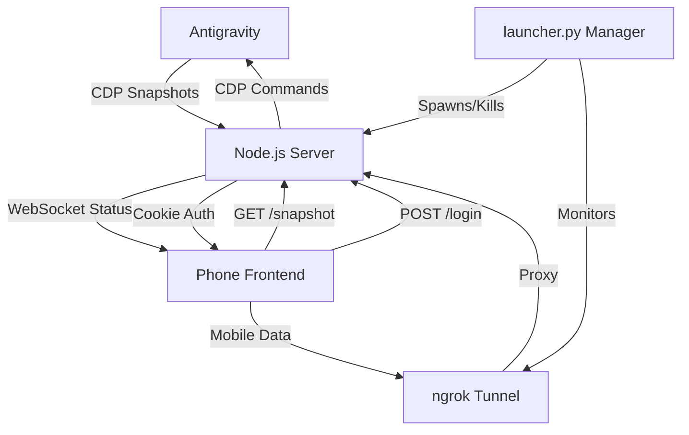

# CODE DOCUMENTATION - Antigravity Phone Connect

## Project Structure
```text
antigravity_phone_chat/
├── server.js                       # Main Node.js server (Express + WebSocket + CDP + HTTPS)
├── generate_ssl.js                 # SSL certificate generator (pure Node.js, no OpenSSL needed)
├── ui_inspector.js                 # Utility for inspecting Antigravity UI via CDP
├── public/
│   ├── index.html                  # Mobile-optimized web frontend
│   ├── css/
│   │   └── style.css               # Main stylesheet (App aesthetics & layout)
│   └── js/
│       └── app.js                  # Client-side logic (WebSocket, API calls, UI interactions)
├── certs/                          # SSL certificates directory (auto-generated, gitignored)
│   ├── server.key                  # Private key
│   └── server.cert                 # Self-signed certificate
├── start_ag_phone_connect.bat      # Standard Windows launcher (LAN)
├── start_ag_phone_connect_web.bat  # Web Windows launcher (Starts server + Global Tunnel)
├── start_ag_phone_connect.sh       # Standard Mac/Linux launcher (LAN)
├── start_ag_phone_connect_web.sh   # Web Mac/Linux launcher (Starts server + Global Tunnel)
├── install_context_menu.bat        # Windows Context Menu installer/manager
├── install_context_menu.sh         # Linux Context Menu installer (Creates .desktop files)
├── launcher.py                     # Unified Python launcher (Manages Server, Tunnel, QR Codes)
├── .env                            # Local configuration (Passwords & API Tokens - gitignored)
├── .env.example                    # Template for environment variables
├── package.json                    # Dependencies and metadata
├── LICENSE                         # GPL v3 License
└── README.md                       # Quick-start guide
```

## High-Level Architecture
The system acts as a "Headless Mirror" of the Antigravity session running on a Desktop machine. It utilizes the **Chrome DevTools Protocol (CDP)** to bridge the gap between a local Antigravity instance and a remote mobile browser.

### Data Flow


## Core Modules & Methods (server.js)

| Module/Function | Description |
| :--- | :--- |
| `killPortProcess()` | Automatically kills any existing process on the server port (prevents EADDRINUSE errors). Works on Windows/Linux/macOS. |
| `getLocalIP()` | Detects local network IP address for mobile access display. |
| `discoverCDP()` | Scans ports (9000-9003) to find the Antigravity instance. |
| `connectCDP()` | Establishes CDP WebSocket with centralized message handling (prevents memory leaks). Uses `pendingCalls` Map with 30s timeout. |
| `captureSnapshot()` | Injects JS into Antigravity to clone the chat DOM, converts local images/SVGs (`vscode-file://`) into Base64 to prevent broken images on mobile, extracts CSS, and returns it. |
| `loadSnapshot()` (Client) | Renders the HTML snapshot and injects CSS overrides for dark mode. |
| `injectMessage()` | Locates the Antigravity input field and simulates typing/submission. Uses `JSON.stringify` for safe escaping. |
| `setMode()` / `setModel()` | Robust text-based selectors to change AI settings remotely. |
| `clickElement()` | Relays a physical click from the phone to the desktop. Uses a **Deterministic Targeting Layer** combining text-anchoring, leaf-most filtering (ignoring parents of targets), and occurrence index tracking to guarantee the correct element is triggered among clones. |
| `remoteScroll()` | Syncs phone scroll position to Desktop Antigravity chat. |
| `getAppState()` | Syncs Mode/Model status and detects history visibility. |
| `startNewChat()` | Triggers the "New Chat" action on Desktop. |
| `getChatHistory()` | Strictly scopes the DOM to the "Select a conversation" pop-up container. This accurately scrapes conversation titles while explicitly filtering out background agent logs or source filenames that might otherwise contaminate the history list. |
| `selectChat()` | Switches the desktop session to a specific conversation title. |
| `closeHistory()` | Simulates an "Escape" keypress on the desktop via CDP to dismiss the history panel. |
| `hasChatOpen()` | Verifies if the editor and chat container are currently rendered. |
| `gracefulShutdown()` | Handles SIGINT/SIGTERM for clean server shutdown. |
| `createServer()` | Creates Express app with automatic HTTP/HTTPS detection and Auth middleware. |

## API Endpoints

| Endpoint | Method | Description |
| :--- | :--- | :--- |
| `/login` | POST | Authenticates user and sets session cookie. |
| `/logout` | POST | Clears session cookie. |
| `/health` | GET | Returns server status, CDP connection state, and uptime. |
| `/snapshot` | GET | Returns latest captured HTML/CSS snapshot. |
| `/app-state` | GET | Returns current Mode (Fast/Planning) and Model. |
| `/ssl-status` | GET | Returns HTTPS status and certificate info. |
| `/send` | POST | Sends a message to the Antigravity chat. Always returns 200 (optimistic). |
| `/stop` | POST | Stops the current AI generation. |
| `/set-mode` | POST | Changes mode to Fast or Planning. |
| `/set-model` | POST | Changes the AI model. |
| `/new-chat` | POST | Starts a new chat session. |
| `/chat-history`| GET | Returns list of recently captured conversation titles. |
| `/select-chat` | POST | Switches the desktop session to a selected conversation. |
| `/close-history` | POST | Programmatically closes the desktop history panel by dispatching an Escape keypress. |
| `/chat-status` | GET | Returns status of the chat container and editor. |
| `/remote-click` | POST | Triggers a click on Desktop. The payload includes the tag type, clean text, and a calculated occurrence index to ensure the correct element is triggered among identical peers. |
| `/remote-scroll` | POST | Syncs phone scroll position to Desktop Antigravity. |
| `/generate-ssl` | POST | Generates SSL certificates (for HTTPS setup via UI). |
| `/debug-ui` | GET | Returns serialized UI tree for debugging. |
| `/ui-inspect` | GET | Returns detailed button and icon metadata for development. |
| `/cdp-targets` | GET | Lists available CDP discovery targets for troubleshooting. |

## Security & Authentication

### 1. Global Web Access (Tunneling)
When using the `_web` launcher, the system utilizes `ngrok` to create a secure tunnel. 
- **Unified Manager**: `launcher.py` acts as a supervisor, spawning the Node.js server as a child process. This ensures that when the tunnel is closed (Ctrl+C), the server is also reliably terminated.
- **Magic Links**: In Web Mode, the launcher generates a "Magic QR Code" that includes the `?key=PASSWORD` parameter, allowing for instant, zero-typing auto-login on mobile.
- **Auto-Protocol Detection**: `launcher.py` detects if the local server is running HTTPS and configures the tunnel accordingly.
- **Passcode Generation**: If no `APP_PASSWORD` is set in `.env`, a temporary 6-digit numeric passcode is generated for the session.
- **Setup Assistant**: Launchers check for `.env`; if missing, they automatically create it using `.env.example` as a template and instruct the user to update it.

### 2. Password Protection
- **Session Management**: Uses signed, `httpOnly` cookies for maximum browser security.
- **Conditional Auth**: Requests from local network IPs (LAN) are automatically exempted from password checks for convenience.
- **WebSocket Auth**: Secure WebSockets verify credentials during the handshake.

### Setup (First Time)
1. **Get an ngrok Token**: Sign up for free at [ngrok.com](https://ngrok.com) and get your "Authtoken".
2. **Automatic Configuration**: Simply run any launcher script. They will detect if `.env` is missing and create it from `.env.example`.
3. **Manual Setup**: Alternatively, create a `.env` file manually or copy the example:
   ```bash
   cp .env.example .env
   ```
   Then update `NGROK_AUTHTOKEN`, `APP_PASSWORD`, and any AI provider keys (e.g., `GROQ_API_KEY`).

### 3. HTTPS/SSL Support
The server automatically detects SSL certificates and enables HTTPS:

1. **Certificate Generation**: Run `node generate_ssl.js`
   - **Hybrid approach**: Tries OpenSSL first (better SAN support), falls back to Node.js crypto
   - Automatically detects local IP addresses for certificate SANs
2. **Auto-Detection**: Server checks for `certs/server.key` and `certs/server.cert`
3. **Protocol Selection**: Uses HTTPS if certs exist, HTTP otherwise
4. **WebSocket**: Automatically uses `wss://` for secure WebSocket when HTTPS is enabled
5. **Web UI**: Users can generate certificates via the "Enable HTTPS" button when running HTTP

## Dependencies

- **Express**: HTTP/HTTPS server for UI and API endpoints.
- **ws**: WebSocket implementation for real-time update notifications.
- **os**: Node.js built-in for local IP detection.
- **fs**: Node.js built-in for SSL certificate file reading.
- **https**: Node.js built-in for secure server (when SSL enabled).
- **Chrome DevTools Protocol (CDP)**: The underlying bridge to Antigravity's browser-based UI.

## Execution Flow

> ⚠️ **The order of these steps matters!** Always start Antigravity with an active chat BEFORE running the server.

### Required Startup Sequence:

1. **Start Antigravity in Debug Mode**
   - Launch Antigravity with: `antigravity . --remote-debugging-port=9000`
   - Or use the context menu: Right-click folder → "Open with Antigravity (Debug)"

2. **Open or Start a Chat**
   - Open an existing chat from the bottom-right panel, OR
   - Start a new chat by typing a message
      - ⚠️ The server requires an active chat (the `#conversation` or `#cascade` element) to capture snapshots

3. **Run the Server** (`start_ag_phone_connect.bat` or `.sh`)
   - **Port Cleanup**: Server automatically kills any existing process on port 3000
   - **CDP Discovery**: Scans ports 9000-9003 to find the running Antigravity instance
   - **SSL Check**: Checks for certificates in `./certs/` and enables HTTPS if found
   - **Polling Starts**: Once connected, polls the UI every 1 second for changes

4. **Connect Your Phone**
   - Open the URL shown in terminal (e.g., `https://192.168.1.5:3000`)
   - Accept SSL certificate warning on first visit
   - Phone receives snapshots via WebSocket notifications

### Runtime Behavior:

- **Snapshot Updates**: If content hash changes, clients are notified via WebSocket
- **Rendering**: Mobile client fetches latest HTML/CSS and renders in a sandboxed div
- **History Management**: 
    - A dedicated **History Icon** in the mobile header allows toggling a newly redesigned full-screen drawer.
    - The drawer displays recently opened chats captured from the desktop's history panel, rendered using premium mobile cards.
    - Tapping a history item triggers a remote click on the desktop to switch conversations, supported by micro-animations on mobile.
- **Scroll Sync**: Phone scroll position syncs to Desktop with user scroll lock protection
- **Shutdown**: On SIGINT/SIGTERM, server gracefully closes all connections before exit

## Security Considerations

- **Self-Signed Certificates**: The generated certificates are self-signed; browsers will show a warning on the first visit.
- **Selective Access**: LAN devices have automatic access. External tunnel connections (Web Mode) require a passcode or Magic Link.
- **Session Security**: Uses signed, `httpOnly` cookies for authentication.
- **Input Sanitization**: User input is escaped using `JSON.stringify` before CDP injection.
- **Output Encoding**: Data scraped from the IDE (like chat history titles) is strictly escaped via an `escapeHtml` utility before being inserted into the mobile DOM to prevent cross-site scripting (XSS).

> 📚 For detailed security information, browser warning bypass instructions, and recommendations, see [SECURITY.md](SECURITY.md).

## Technical Implementation Details (Advanced)

### Synchronization Philosophy: Deterministic Mirroring
The system utilizes a dual-pass targeting architecture to maintain deterministic state matching between the Phone (Client) and Antigravity (CDP):
1.  **Semantic Indexing**: When an element is tapped on mobile, the client calculates its `occurrence index` relative only to other elements with the same text and tag within the chat container.
2.  **Leaf-Node Isolation**: In dynamically generated trees, standard selectors often return multiple nested layers for a single visual target (e.g., `button > span > text`). The server implements **Leaf-Most Filtering**: if multiple matching elements are found in a parent-child relationship, the system automatically discards the parent and targets the inner-most "leaf" node.
3.  **Interaction Priority**: The mobile device is treated as the **Master Controller**. Any manual interaction (scrolling, clicking, typing) on the phone triggers an immediate CDP command to the Desktop.
- **Scroll Synchronization**: Synchronization is strictly **Phone → Desktop**. This design choice prevents "sync-fighting" conflicts and allows the mobile user to maintain a stable viewport regardless of background window movement on the Desktop.
- **Master-Slave Rebalancing**:
    - **Lock Duration**: A `3000ms` lock is applied when the user touches the phone screen, protecting the mobile viewport from auto-scroll triggers caused by incoming message events.
    - **Idle State**: After `5000ms` of inactivity, the phone enters an "Observation Mode" where it allows auto-scrolling to follow new incoming chat content.

### Performance & Processing Efficiency
- **Snapshot Polling**: The server polls the Antigravity CDP endpoint every `1000ms` to check for UI changes.
- **Delta Detection**: To minimize processing pressure, the system calculates a 36-char hash of the captured HTML. A full broadcast (Snapshot Update) ONLY occurs if the hash changes.
- **Interaction Overhead**: Typical POST interactions (sending a message or changing a model) have a latency overhead of `<100ms`, making the remote interaction feel near-instant.

### Snapshot Cleanup & Interaction Filtering
To ensure a clean "Observation Mode" on mobile, the server performs an aggressive cleanup of the captured DOM before sending it to the client:
1.  **Interaction Area Removal**: The entire bottom interaction wrapper (input box, send buttons, model selection) is identified and removed.
2.  **Context Bar Hiding**: "Review Changes" and "Files With Changes" bars are automatically stripped using structural and keyword-based filtering.
3.  **Visual Overrides**: Custom CSS injections ensure that Desktop-specific UI elements (like scrollbars or specific borders) are masked. Specifically, a precise **glassmorphism styling** and modern dark-mode tracking are applied to the mobile quick-action (prompt pills like "Explain this code") and settings headers for enhanced readability and aesthetics.
4.  **Model State Tracking**: Advanced DOM scraping dynamically tracks active models from Desktop (including the latest Gemini and Claude models), mirroring them seamlessly onto the mobile interface.
5.  **Error-Safe Cleanup**: The filtering logic uses `try-catch` blocks and safe `classList` checks to prevent CDP execution errors when encountering legacy or non-standard SVG elements.
